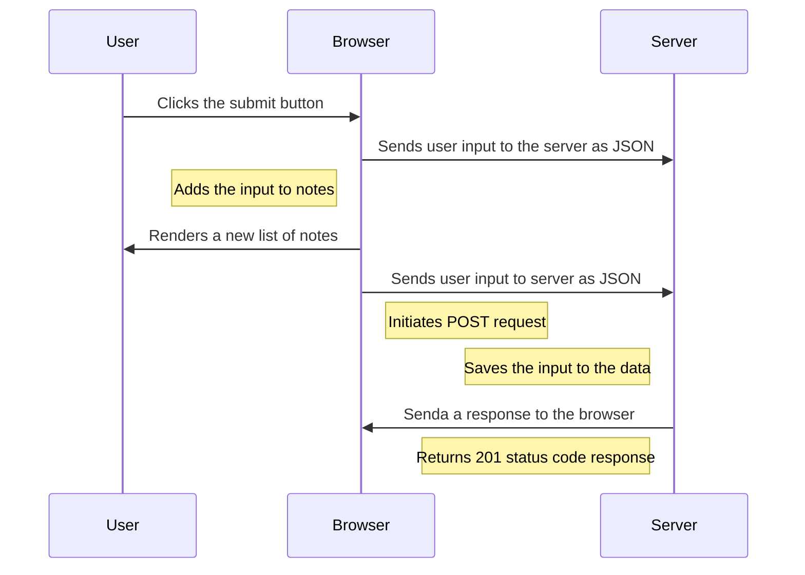

```mermaid
sequenceDiagram
    participant U as User
    participant B as Browser
    participant S as Server

    U->>B: Clicks the submit button
    B->>S: Sends user input to the server as JSON
    Note left of B: Adds the input to notes
    B->>U: Renders a new list of notes
    B->>S: Sends user input to server as JSON
    Note right of B: Initiates POST request
    Note left of S: Saves the input to the data
    S->>B: Senda a response to the browser
    Note left of S: Returns 201 status code response
```
