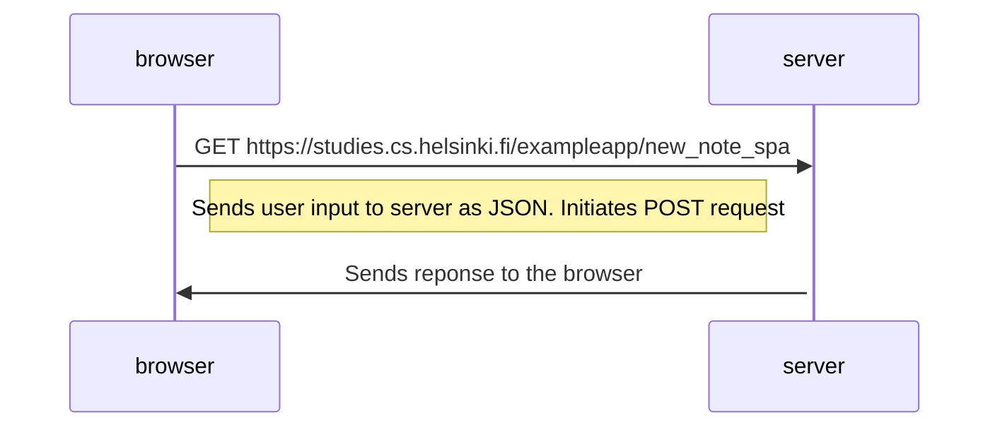

The sequence diagram shows the situation in which the user creates a new note using the app's single-page version.

```mermaid
sequenceDiagram
    participant browser
    participant server

    browser->>server: GET https://studies.cs.helsinki.fi/exampleapp/new_note_spa
    activate server
    
    Note right of browser: Sends user input to server as JSON. Initiates POST request

    server->>browser: Sends reponse to the browser
```