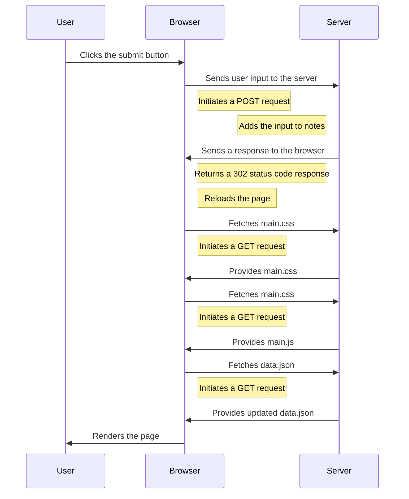

```mermaid
sequenceDiagram
    participant U as User
    participant B as Browser
    participant S as Server

    U->>B: Clicks the submit button
    B->>S: Sends user input to the server
    Note right of B: Initiates a POST request
    Note left of S: Adds the input to notes
    S->>B: Sends a response to the browser
    Note left of S: Returns a 302 status code response
    Note right of B: Reloads the page
    B->>S: Fetches main.css
    Note right of B: Initiates a GET request
    S->>B: Provides main.css
    B->>S: Fetches main.css
    Note right of B: Initiates a GET request
    S->>B: Provides main.js
    B->>S: Fetches data.json
    Note right of B: Initiates a GET request
    S->>B: Provides updated data.json
    B->>U: Renders the page

```
