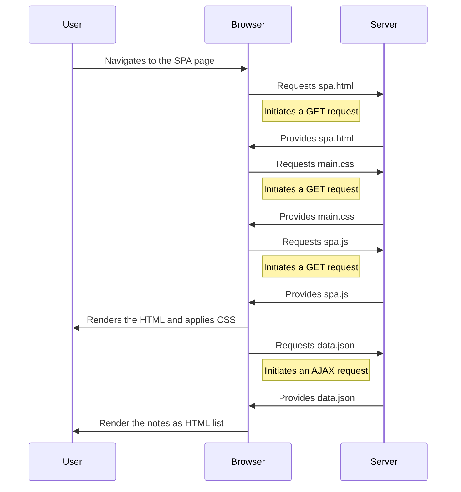

```mermaid
sequenceDiagram
    participant U as User
    participant B as Browser
    participant S as Server

U->>B: Navigates to the SPA page
B->>S: Requests spa.html
Note right of B: Initiates a GET request
S->>B: Provides spa.html
B->>S: Requests main.css
Note right of B: Initiates a GET request
S->>B: Provides main.css
B->>S: Requests spa.js
Note right of B: Initiates a GET request
S->>B: Provides spa.js
B->>U: Renders the HTML and applies CSS
B->>S: Requests data.json
Note right of B: Initiates an AJAX request
S->>B: Provides data.json
B->>U: Render the notes as HTML list
```